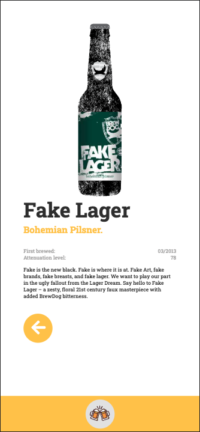

# React Beer App (Api), Mobile

# [Vercel Deployment](https://beer-app-lovat.vercel.app/)

<div>

</div>

# Animation

I was inspired by :

```
https://codepen.io/clemishow/pen/ZYPPeE

https://dribbble.com/shots/1975846-Beer-loader

```

to make the Loading animation, I had to adapt some positions and structure to be able to use it in my `scss`. I have also made a Gif of it to be shown here, but in this repository I use the code and not the gif.

# Mobile

<div>





</div>
